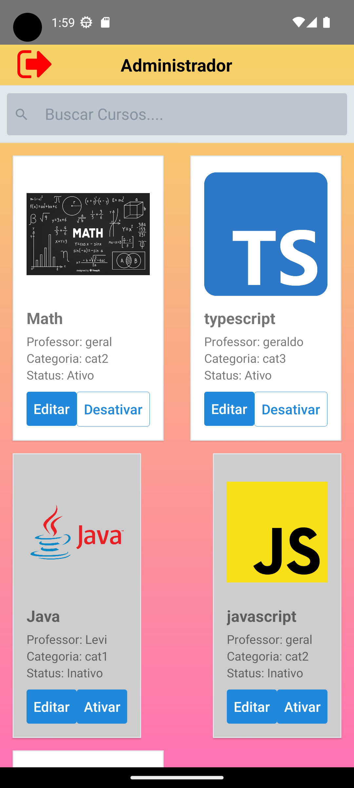

# :hammer: Funcionalidades do projeto

- `Funcionalidade 1`: Cadastro de usuário: Admin e Normal
- `Funcionalidade 2`: Tela Cadastro de Curso: Criar Cursos
- `Funcionalidade 3`: Tela de Gerenciar Curso (Admin): Editar e Ativar/Desativar e pesquisar

# 📱 Telas 

  

      
<strong>Tela Login:</strong> Cadastro do usuário

    
  

  

     
<strong>Tela Cadastro:</strong> Descrição da tela de cadastro

    
  

  

     
<strong>Tela Admin:</strong> Descrição da tela de administração

    
  

